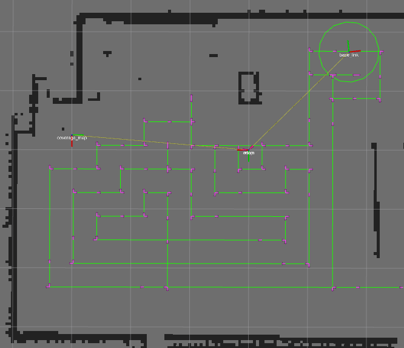
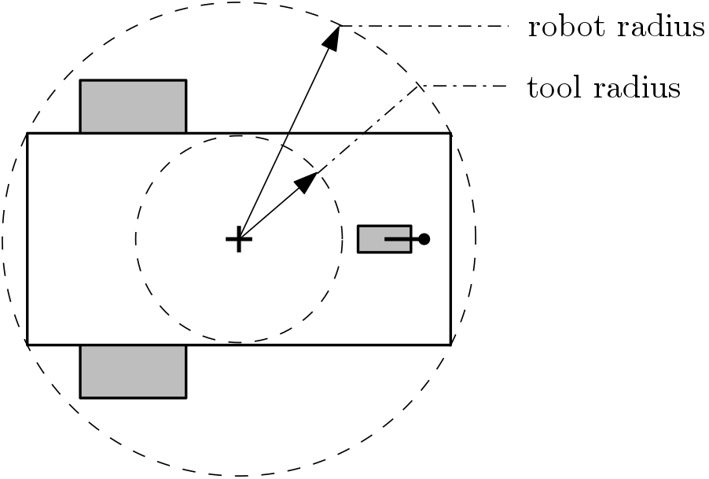

# Full Coverage Path Planner (FCPP)

> :grey_exclamation: This package is not in use by our company anymore. Contributions to this package are still welcome!

Paid support options are also available, please contact us at [nobleo-technology.nl](https://nobleo-technology.nl).

## Overview

This package provides an implementation of a Full Coverage Path Planner (FCPP) using the Backtracking Spiral Algorithm (BSA), see [1].

This packages acts as a global planner plugin to the Move Base package (http://wiki.ros.org/move_base).

The user can configure robot radius and tool radius separately:

**Keywords:** coverage path planning, move base

### License

Apache 2.0

**Author(s): Yury Brodskiy, Ferry Schoenmakers, Tim Clephas, Jerrel Unkel, Loy van Beek, Cesar lopez**

**Maintainer:  Cesar Lopez, cesar.lopez@nobleo.nl**

**Affiliation: Nobleo Projects BV, Eindhoven, the Netherlands**

The Full Coverage Path Planner package has been tested under [ROS] Melodic and Ubuntu 18.04.

## Installation

### Building from Source

#### Dependencies

- [Robot Operating System (ROS)](http://wiki.ros.org) (middleware for robotics),
- [Move Base Flex (MBF)](http://wiki.ros.org/move_base_flex) (move base flex node) used for system testing

#### Building

To build from source, clone the latest version from this repository into your workspace and compile the package using

    cd catkin_workspace/src
    git clone https://github.com/nobleo/full_coverage_path_planner.git
    cd ../
    catkin_make

### Unit Tests

All tests can be run using:

    catkin build full_coverage_path_planner --catkin-make-args run_tests

#### test_common
Unit test that checks the basic functions used by the repository

#### test_spiral_stc
Unit test that checks the basis spiral algorithm for full coverage. The test is performed for different situations to check that the algorithm coverage the accessible map cells. A test is also performed in randomly generated maps.

#### test_full_coverage_path_planner.test
ROS system test that checks the full coverage path planner together with a tracking pid. A simulation is run such that a robot moves to fully cover the accessible cells in a given map.

## Usage

Run a full navigation example using:

    roslaunch full_coverage_path_planner test_full_coverage_path_planner.launch

Give a 2D-goal in rviz to start path planning algorithm

Depends on:

[mobile_robot_simulator](https://github.com/mrath/mobile_robot_simulator.git) that integrates /cmd_vel into a base_link TF-frame and an odometry publisher

[tracking_pid](https://github.com/nobleo/tracking_pid/) Global path tracking controller

## Launch files

### test/full_coverage_path_planner/test_full_coverage_path_planner.launch

Runs the full_coverage_path_planner global planner in combination with tracking PID local planner.
Moreover a coverage progress tracking node is launched to monitor the coverage progress.
Mobile_robot_simulator is used to integrate cmd_vel output into TF and odometry.

Arguments:

* **`map`**: path to a global costmap. Default: `$(find full_coverage_path_planner)/maps/basement.yaml)`
* **`target_x_vel`**: target x velocity for use in interpolator. Default: `0.2`
* **`target_yaw_vel`**: target yaw velocity for use in interpolator. Default: `0.2`
* **`robot_radius`**: radius of the robot for use in the global planner. Default: `0.6`
* **`tool_radius`**: radius of the tool for use in the global planner. Default: `0.2`

Start planning and tracking by giving a 2D nav goal.

## Nodes

### coverage_progress
The CoverageProgressNode keeps track of coverage progress. It does this by periodically looking up the position of the coverage disk in an occupancy grid. Cells within a radius from this position are 'covered'

#### Subscribed Topics

* **`/tf`** ([tf2_msgs/TFMessage])
    ros tf dynamic transformations
* **`/tf_static`** ([tf2_msgs/TFMessage])
    ros tf static transformations
#### Published Topics

* **`/coverage_grid`** ([nav_msgs/OccupancyGrid])
    occupancy grid to visualize coverage progress
* **`/coverage_progress`** ([std_msgs/Float32])
    monitors coverage (from 0 none to 1 full) on the given area

#### Services

* **`/coverage_progress/reset`** ([std_srvs/SetBool])
    resets coverage_progress node. For instance when robot position needs to be manually updated

#### Parameters

* **`target_area/x`**: size in x of the target area to monitor
* **`target_area/y`**: size in y of the target area to monitor
* **`coverage_radius`**: radius of the tool to compute coverage progress

## Plugins
### full_coverage_path_planner/SpiralSTC
For use in move_base(\_flex) as "base_global_planner"="full_coverage_path_planner/SpiralSTC". It uses global_cost_map and global_costmap/robot_radius.

#### Parameters

* **`robot_radius`**: robot radius, which is used by the CPP algorithm to check for collisions with static map
* **`tool_radius`**: tool radius, which is used by the CPP algorithm to discretize the space and find a full coverage plan

## References

[1] GONZALEZ, Enrique, et al. BSA: A complete coverage algorithm. In: Proceedings of the 2005 IEEE International Conference on Robotics and Automation. IEEE, 2005. p. 2040-2044.

## Bugs & Feature Requests

Please report bugs and request features using the [Issue Tracker](https://github.com/nobleo/full_coverage_path_planner/issues).

[ROS]: http://www.ros.org
[rviz]: http://wiki.ros.org/rviz
[MBF]: http://wiki.ros.org/move_base_flex

## Acknowledgments

<!--
    ROSIN acknowledgement from the ROSIN press kit
    @ https://github.com/rosin-project/press_kit
-->

Supported by ROSIN - ROS-Industrial Quality-Assured Robot Software Components.
More information: <a href="http://rosin-project.eu">rosin-project.eu</a>

This project has received funding from the European Union’s Horizon 2020
research and innovation programme under grant agreement no. 732287.
